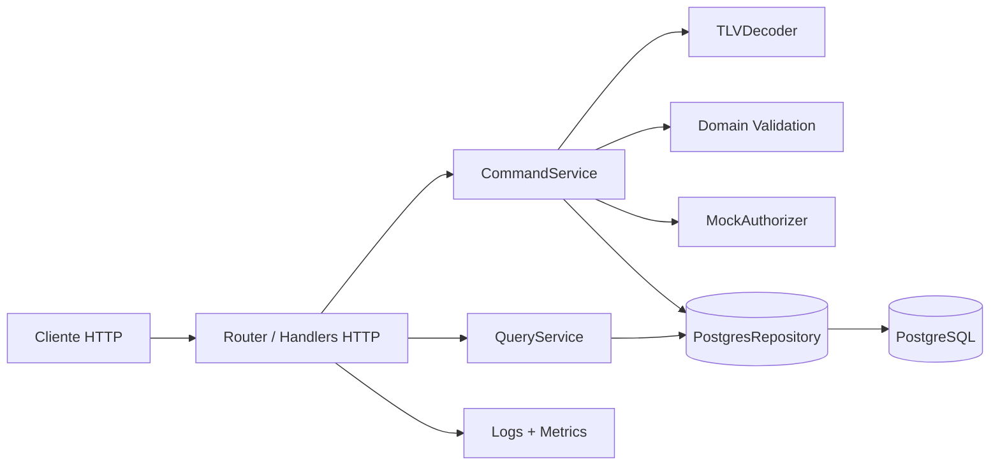
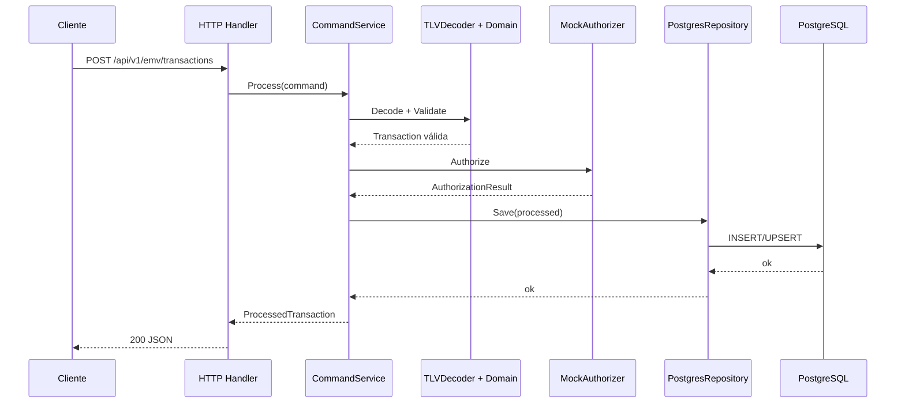
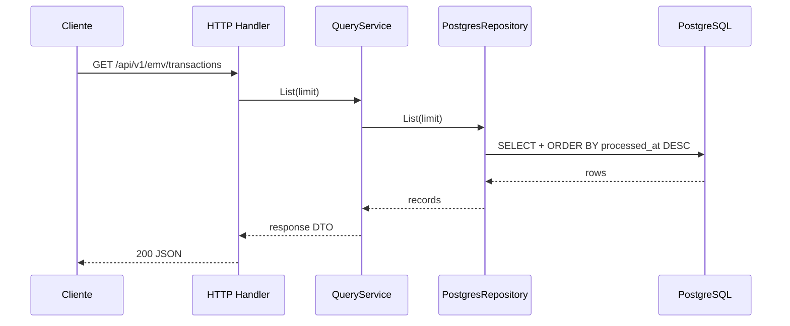
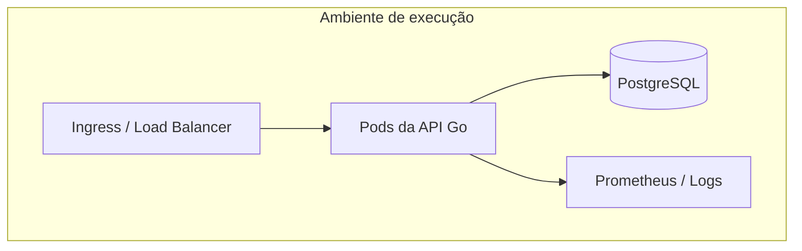

# Arquitetura e escalabilidade

Este documento consolida a arquitetura atual da aplicação, os fluxos principais e uma análise objetiva de escalabilidade com base na implementação existente.

## 1. Visão geral

A aplicação segue um modelo de **vertical slice** com um slice principal de `transactions`, organizado em quatro camadas:

- **domain**: validações e invariantes de negócio da transação EMV;
- **application**: orquestração dos casos de uso de comando e consulta;
- **infrastructure**: persistência PostgreSQL, decoder TLV e autorizador mock;
- **interfaces/http**: endpoints REST, roteamento e serialização JSON.

Essa composição gera um sistema simples de entender, com baixo acoplamento entre regras de negócio e entrega HTTP.

## 2. Componentes principais

### Responsabilidades por componente

| Componente | Papel |
| --- | --- |
| `cmd/api` | bootstrap, config, métricas, logger, ciclo de vida do servidor |
| `application.CommandService` | fluxo síncrono de processamento, autorização e persistência |
| `application.QueryService` | leitura paginada e busca por `correlation_id` |
| `domain.Transaction` | invariantes de PAN, validade, CVM, amount e currency |
| `infrastructure.PostgresRepository` | persistência e consulta no PostgreSQL |
| `interfaces/http.Handler` | tradução HTTP ↔ casos de uso |
| `observability.Metrics` | contadores/histogramas in-memory com saída Prometheus |

## 3. Fluxo de processamento

### 3.1 Fluxo de comando

### 3.2 Fluxo de consulta

## 4. Diagrama de implantação

## 5. Pontos fortes da arquitetura atual

1. **Separação clara de responsabilidades**: domínio e aplicação não dependem diretamente da camada HTTP.
2. **Evolução facilitada**: o slice `transactions` já está preparado para crescer sem contaminar outras áreas.
3. **Scale-out simples da API**: o servidor HTTP é stateless e pode ser replicado horizontalmente.
4. **CQRS leve já iniciado**: a separação entre `CommandService` e `QueryService` reduz acoplamento conceitual.
5. **Operabilidade básica**: healthcheck, métricas e logs estruturados já existem.

## 6. Análise de escalabilidade

### 6.1 Estado atual

Do ponto de vista de escalabilidade, o projeto está em uma **faixa intermediária de maturidade**:

- está **acima de um CRUD simples**, porque já possui boas fronteiras arquiteturais;
- mas ainda está **abaixo de um serviço pronto para alta concorrência**, principalmente por decisões da camada de persistência e operação.

### 6.2 Principais gargalos atuais

#### 1. Persistência via `psql` + `os/exec`

Esse é o principal ponto de atenção.

Cada operação no repositório executa um processo externo `psql`, o que implica:

- custo de criação de processo por request;
- maior latência em leitura e escrita;
- ausência de pool de conexões administrado pela aplicação;
- maior uso de CPU sob concorrência;
- comportamento mais difícil de observar e tunar.

**Impacto prático**: o throughput deve degradar rapidamente quando o volume de requisições crescer.

#### 2. Banco como ponto único de contenção

Embora exista separação lógica entre leitura e escrita, ambas usam a mesma tabela `transactions`.

Isso é suficiente para o estágio atual, mas em cenários de crescimento pode gerar:

- contenção entre `INSERT/UPSERT` e consultas frequentes;
- dificuldade para criar projeções otimizadas por caso de uso;
- limitação para escalar leitura independentemente da escrita.

#### 3. Kubernetes ainda básico

O manifesto atual é útil como base, porém não cobre aspectos necessários para escala operacional:

- apenas 1 réplica;
- ausência de `resources.requests` e `resources.limits`;
- ausência de HPA;
- ausência de `PodDisruptionBudget` e estratégia explícita de rollout.

#### 4. Observabilidade limitada para produção

As métricas atuais funcionam, mas ainda são minimalistas:

- counters e histogramas vivem em memória do processo;
- não há tracing distribuído;
- não há correlação ponta a ponta entre request, banco e autorizador.

Em ambiente com múltiplas réplicas, isso reduz a visibilidade operacional se não houver coleta adequada por instância.

#### 5. Evolução de schema ainda manual

A criação da tabela ocorre na inicialização do repositório.

Isso simplifica o setup local, porém traz riscos para produção:

- versionamento insuficiente de alterações de schema;
- rollout mais difícil entre versões incompatíveis;
- menor previsibilidade em pipelines de deploy.

## 7. Classificação objetiva

### Escalabilidade horizontal da API

**Boa**, porque a camada HTTP é stateless e o processamento é síncrono/determinístico.

### Escalabilidade da persistência

**Baixa a moderada**, por causa do uso de `psql` por comando e da ausência de pool de conexões.

### Escalabilidade de leitura

**Moderada**, porque já existe separação lógica de consultas, mas ainda não há read model dedicado.

### Escalabilidade operacional

**Básica**, porque existem probes e métricas, mas faltam recursos clássicos de produção.

## 8. Recomendações priorizadas

### Prioridade 1 — remover o maior gargalo

- substituir `os/exec + psql` por `pgxpool` ou `database/sql`;
- parametrizar queries em vez de montar SQL manualmente;
- medir latência de banco e saturação do pool.

### Prioridade 2 — preparar o banco para crescimento

- criar migrations versionadas;
- manter índices aderentes aos padrões de consulta;
- avaliar partição, retenção e arquivamento caso o volume cresça;
- considerar réplica de leitura ou read model dedicado.

### Prioridade 3 — fortalecer operação em Kubernetes

- aumentar `replicas`;
- definir `requests` e `limits`;
- configurar HPA baseado em CPU/RPS/latência;
- adicionar rollout strategy e `PodDisruptionBudget`.

### Prioridade 4 — observabilidade de produção

- integrar Prometheus real, dashboards e alertas;
- adicionar tracing com OpenTelemetry;
- propagar `correlation_id` e request id em logs e métricas.

### Prioridade 5 — evolução arquitetural conforme demanda

Se a volumetria crescer muito, uma evolução natural seria:

1. command side persiste evento/estado transacional;
2. read side mantém projeções específicas para consulta;
3. autorização externa vira integração resiliente com timeout, retry e circuit breaker;
4. filas/eventos passam a amortecer picos de carga quando houver processamento assíncrono.

## 9. Conclusão

**Resumo curto**: a arquitetura do projeto é boa para manutenção e evolução, mas a escalabilidade hoje é limitada principalmente pela forma de acesso ao PostgreSQL e pela maturidade operacional ainda inicial.

Se o objetivo for suportar tráfego baixo a moderado, o projeto atende bem. Se o objetivo for suportar crescimento consistente ou carga alta, o primeiro investimento deve ser a modernização da persistência e da operação em produção.
